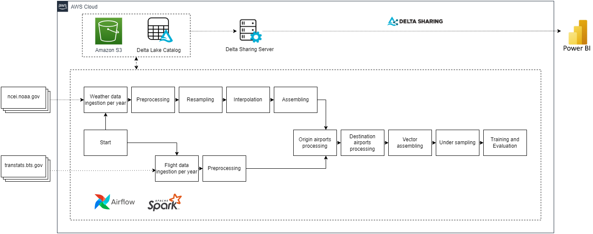

# Predicting flight delays at scale

The purpose of this project is to predict flight delays due to extreme weather conditions from a big data processing application.
Apache Spark and Scala are used for data processing and modeling, Apache Airflow is used for workflow automation,
Amazon S3 and Delta lake for storage, and PowerBI is used for visualization. Flight data are provided by the
[Bureau of Transportation Statistics](https://www.transtats.bts.gov/DL_SelectFields.aspx?gnoyr_VQ=FGJ&QO_fu146_anzr=b0-gvzr)
that compiles, analyzes and publishes information on transportation systems in the USA. In particular, they provide a
[delay cause Definition](https://www.bts.gov/topics/airlines-and-airports/understanding-reporting-causes-flight-delays-and-cancellations).
Weather data are provided by the [NCEI](https://www.ncei.noaa.gov/),
a US government agency that manages one of the world's largest archives of atmospheric,
coastal, geophysical, and oceanic data.
We use [Local Climatological Data](https://www1.ncdc.noaa.gov/pub/data/cdo/documentation/LCD_documentation.pdf)
that provide a monthly synopses of climatic values for individual weather station.

<p align="center">
  
</p>

### Data visualization

Figures and PowerBI analysis report are available on the [dedicated web page](https://edy17.github.io/predicting-flight-delays/report.html).

### Set up project

Copy the project files to the `$AIRFLOW_HOME` folder or set this folder as Airflow's home directory by running:

```bash
export AIRFLOW_HOME=<current root repository>
```

### Building project

Using [Sbt](https://www.scala-sbt.org/), run in the current root repository:
```bash
sbt clean package
```

### Running Airflow pipeline from REST API

- Requirements:
    - Apache Airflow cluster and his webserver available at `https://example.com`
    - [Basic authentication](https://airflow.apache.org/docs/apache-airflow/stable/stable-rest-api-ref.html#section/Authentication) enabled
    - [Apache Spark provider](https://airflow.apache.org/docs/apache-airflow-providers-apache-spark/stable/index.html#installation)
    - [Spark connection](https://airflow.apache.org/docs/apache-airflow-providers-apache-spark/stable/connections/spark-connect.html)
      configured with id `spark_cluster`
    - [AWS provider](https://airflow.apache.org/docs/apache-airflow-providers-amazon/stable/index.html)
    - [AWS connection](https://airflow.apache.org/docs/apache-airflow-providers-amazon/stable/connections/aws.html)
      configured with id `aws_conn` and having permissions policies giving read and write access to a bucket named for example
      `predicting-flight-delays` in this project


Once all requirements are met, DAG can be run using:

```bash
curl --location 'https://example.com/api/v1/dags/flight_delays_modeling_dag/dagRuns' \
--header 'Content-Type: application/json' \
--header 'Accept: application/json' \
--user "username:password" \
--data '{"dag_run_id": "example_id"}'
```
